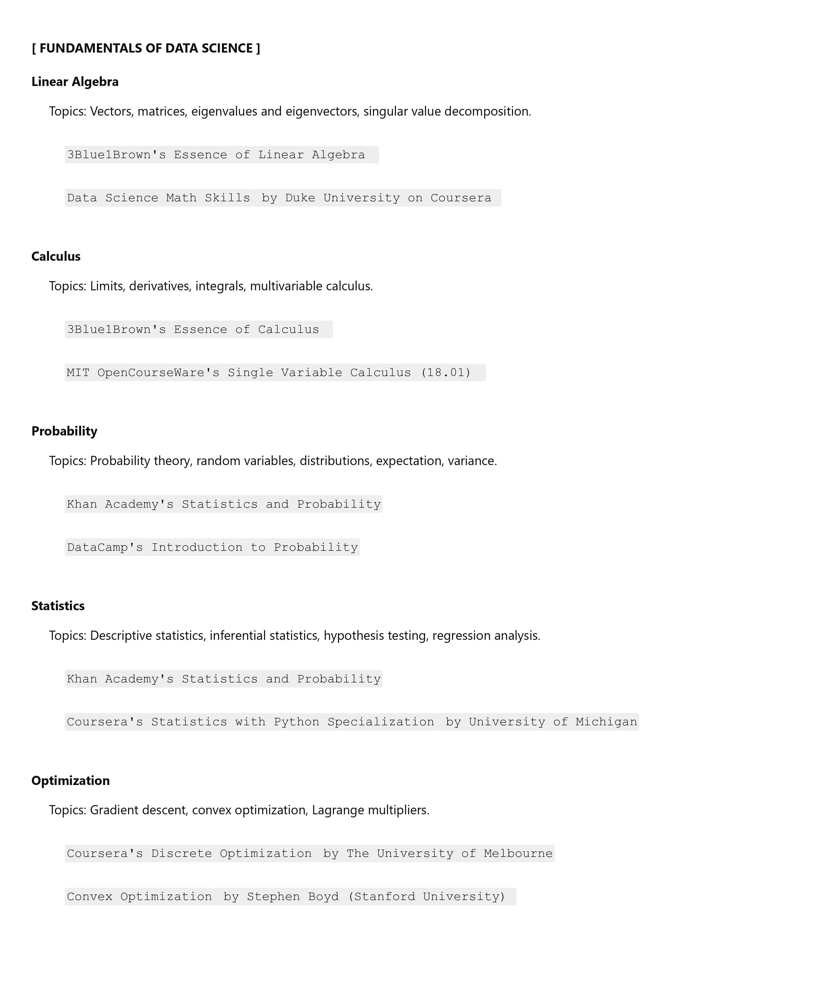
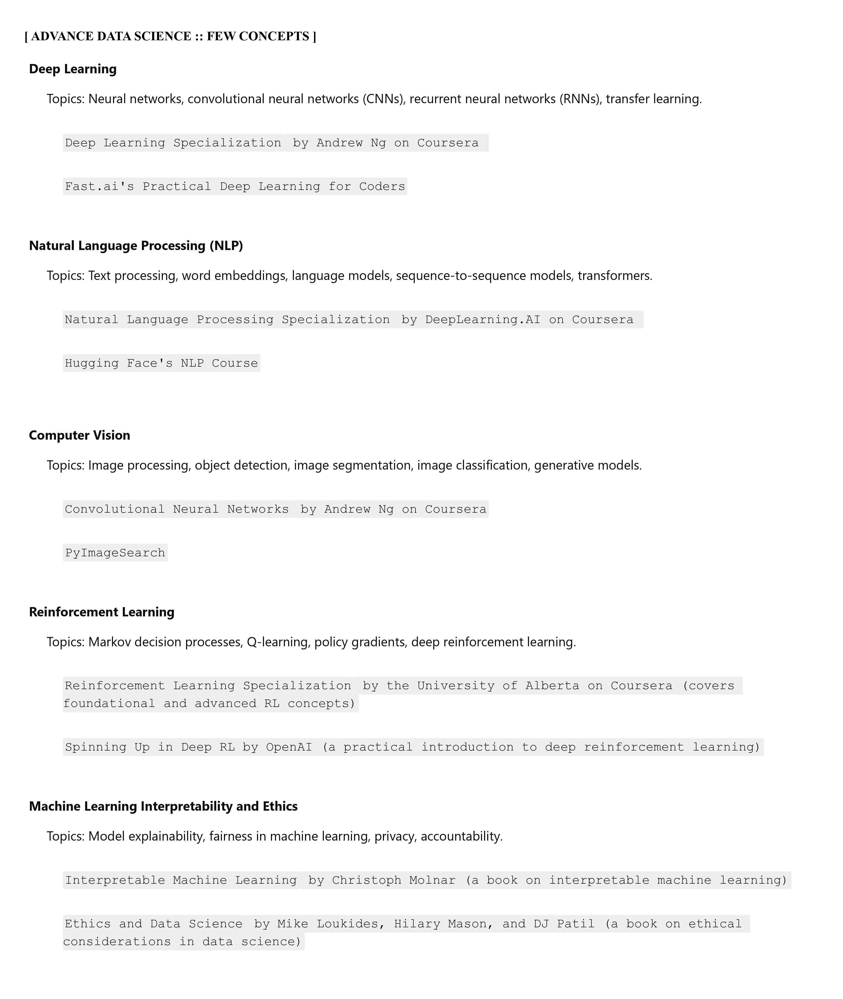

# *<u>@AI Certifications</u> #

## [A.1] FOUNDATIONS
> <b>FOUNDATION 1</b>  
*[UDEMY :: Machine Learning & Data Science](https://www.udemy.com/course/complete-machine-learning-and-data-science-zero-to-mastery/?couponCode=ACCAGE0923)  
[AI Engineer RoadMap](./_learninglinks-resources/ai-engineer-roadmap_2024.pdf)  
 

> FOUNDATION 2  

### [A.2] IBM :: Machine Learning | AI Engineering Professional Certificate
#### Courses ::
- https://www.coursera.org/professional-certificates/ibm-machine-learning
- https://www.coursera.org/professional-certificates/ai-engineer

### [A.3] Google Cloud :: Professional Machine Learning Engineer

 

#### Courses ::
- https://www.coursera.org/professional-certificates/preparing-for-google-cloud-machine-learning-engineer-professional-certificate
- https://www.udemy.com/course/google-cloud-machine-learning-engineer-certification-prep/
- https://www.udemy.com/course/machine-learning-with-google-cloud/
- https://www.coursera.org/professional-certificates/preparing-for-google-cloud-machine-learning-engineer-professional-certificate?action=enroll

#### Tests ::

> MISCELLANEOUS COURSES 
> https://www.coursera.org/search?query=deeplearning.ai&language=English&productTypeDescription=Specializations&sortBy=BEST_MATCH]

 
 
 

## [B.1] Google Cloud :: Professional Cloud Architect & Microservices

 

### Courses ::
- *<b>https://www.udemy.com/course/google-cloud-professional-cloud-architect-certification/?couponCode=ST6MT42324</b>
- *<b>https://lex.infosysapps.com/en/app/toc/lex_auth_0130446713200066561248/overview</b>
- https://www.udemy.com/course/google-cloud-professional-architect-get-certified/?couponCode=ST6MT42324
- https://www.udemy.com/course/java-microservices-cqrs-event-sourcing-with-kafka/
- https://www.udemy.com/course/gcp-architect-am/?couponCode=ST6MT42324
- https://www.udemy.com/course/microservices-clean-architecture-ddd-saga-outbox-kafka-kubernetes/
- 
- https://www.coursera.org/professional-certificates/gcp-cloud-architect 
- https://www.youtube.com/watch?v=XzYfN9y0W3A (Dynatrace End to End session in 8 Hours)

- (code references) 
- https://github.com/dogaanismail/bank-solution
- https://shopizer-ecommerce.github.io/documentation/#/starting/architecture
### Tests ::
 

## [B.2] Google Cloud :: Professional Cloud Security Engineer

 

### Courses ::

### Tests ::
 

### [B.3] Certified Kubernetes Administrator (CKA)

#### Courses ::
- https://www.udemy.com/course/certified-kubernetes-administrator-with-practice-tests/
- https://www.whizlabs.com/learn/course/certified-kubernetes-administrator/299/oc/
- https://www.udemy.com/course/cka-ckad-crash-course/
- https://www.udemy.com/course/kubernetes-microservices/ (Kubernetes Hands-On - Deploy Microservices to the AWS Cloud)
- https://lex.infosysapps.com/web/en/app/toc/lex_auth_013102937829859328878/overview/ (Kubernetes Deployment Strategies)
-
- https://www.udemy.com/course/openshift-for-developers/

#### Tests ::
- https://www.udemy.com/course/certified-kubernetes-administrator-2021-cka-mock-exams/
- https://www.udemy.com/course/certified-kubernetes-administrator-cka-practice-exams/
- https://www.udemy.com/course/cka-linux-foundation-certified-kubernetes-administrator/
- https://www.udemy.com/course/certified-kubernetes-administrator-cka-4-practice-tests/
- https://www.udemy.com/course/certified-kubernetes-administrator-cka-exam-patrice-test/
- https://lex.infosysapps.com/web/en/app/toc/lex_auth_013102946513051648881/certification/TETAIMSADMIC1004
- https://lex.infosysapps.com/web/en/app/toc/lex_auth_0131587811603824641/certification/TETAIMSADMIC2013
 
 
 
 
 

